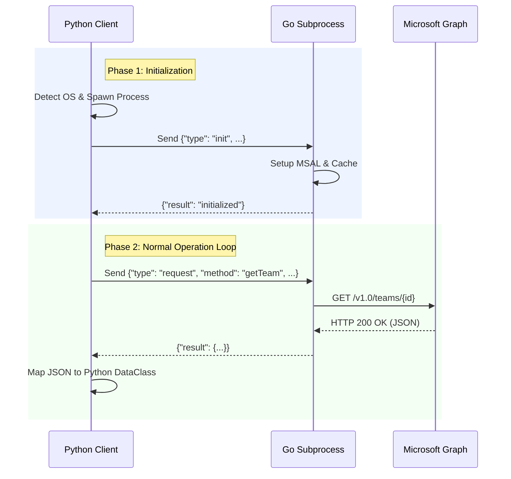

# Teams Lib Wrapper

Welcome to the documentation for the **Teams API library**.
This library provides a high-level, Pythonic interface for managing Microsoft Teams, leveraging a compiled Go backend for performance, authentication, and caching.

---

## Overview

This project bridges the gap between Python's ease of use and Go's concurrency model.
It acts as a wrapper around a Go binary (`teamsClientLib`), communicating via a JSON-based IPC (Inter-Process Communication) protocol.

---

## Key Features

- **Pythonic Data Models**
  Uses standard Python `dataclasses` and `Enum`s instead of raw JSON or complex Microsoft Graph SDK objects.

- **Automatic Caching**
  Reduces API calls by caching Team and Channel references (handled transparently by the Go backend).

- **Simple Authentication**
  Thin wrappers around MSAL (Microsoft Authentication Library) configuration.

- **Type Hinting**
  Full support for static type checkers like `mypy` and IDE autocompletion.

---

## Installation

Library is available fully via pip

```bash
pip install teams_lib_pzsp2_z1
```

## Quick start

### 1. Configuration

Create a `.env` in your project with your Azure AD credentials:

```ini
CLIENT_ID=your-client-id-uuid
TENANT_ID=your-tenant-id-uuid
EMAIL=user@example.com
SCOPES=User.Read,Team.ReadBasic.All,Channel.ReadBasic.All
AUTH_METHOD=DEVICE_CODE [or INTERACTIVE]
```

Scopes needed by all functions could be found in [.env.template](https://github.com/pzsp-teams/lib-python/tree/main/.env.template).

### 2. Basic usage

Here is a minimal example showing how to initialize the client and list joined teams:

```python
from teams_lib_pzsp2_z1.client import TeamsClient
from teams_lib_pzsp2_z1.config import CacheMode

def main():
    # Initialize the client.
    # This spawns the Go subprocess and performs authentication.
    client = TeamsClient()

    try:
        print("Fetching teams...")
        teams = client.teams.list_my_joined()

        for team in teams:
            print(f"Team: {team.display_name} | ID: {team.id}")

            # Example: List channels in the first team
            channels = client.channels.list_channels(team.id)
            print(f"  -> Found {len(channels)} channels.")

    except RuntimeError as e:
        print(f"An error occurred: {e}")

    finally:
        # Crucial: Close the client to ensure background cache writes finish
        # and the Go subprocess is terminated gracefully.
        client.close()

if __name__ == "__main__":
    main()
```

## Architecture

The library relies on a compiled Go backend to handle performance-critical tasks. When `TeamsClient` is initialized, the following sequence occurs:

1.  **OS Detection**: The library checks the host operating system (Windows/Linux).
2.  **Process Launch**: It launches the corresponding Go binary as a background subprocess.
3.  **Initialization**: It sends an `init` command via `stdin` to configure the MSAL authentication provider and the caching engine.
4.  **Request Handling**: Subsequent method calls (e.g., `client.teams.get(...)`) follow this flow:
    - Arguments are **serialized to JSON**.
    - The payload is sent to the Go process via **stdin**.
    - The Go process executes the request against the **Microsoft Graph API**.
    - The JSON response is read from **stdout** and mapped back to native **Python objects**.

### Process Flow Diagram


